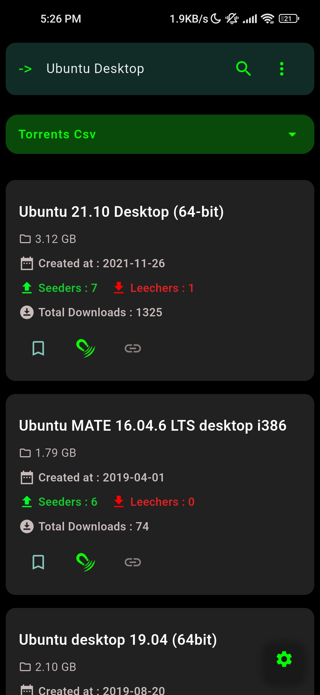
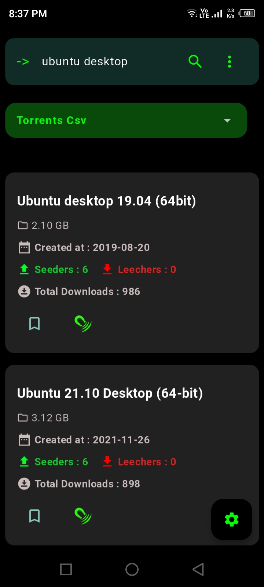
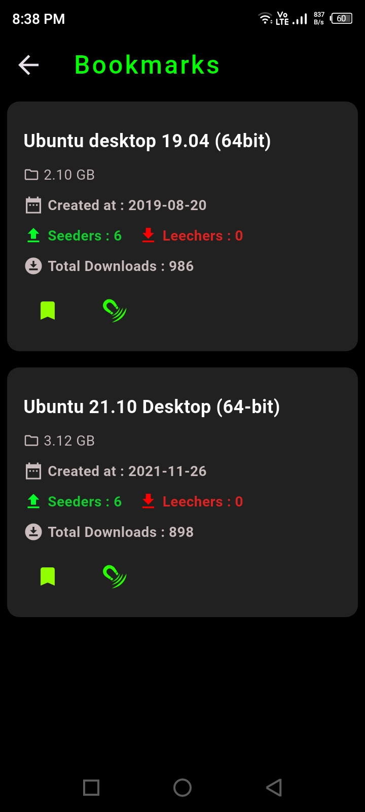
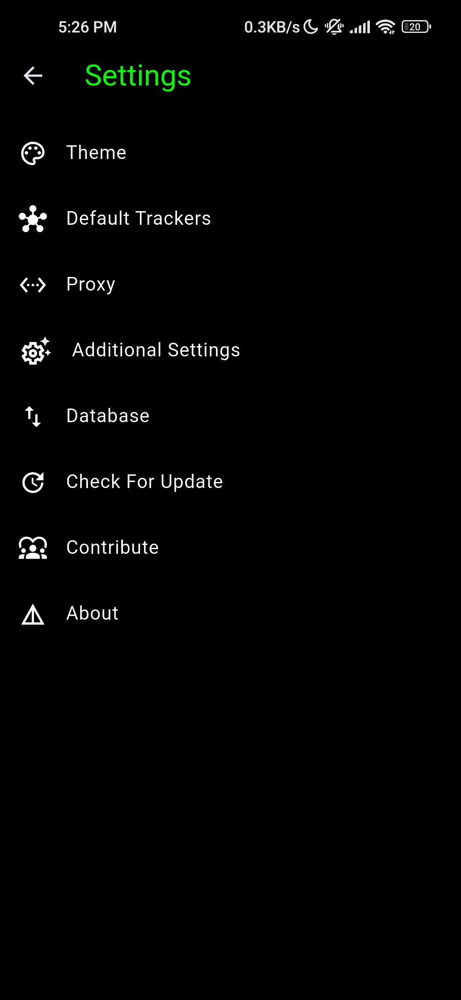

# Torrents Digger - Digs Torrents from the Internet.

### -> Join [Matrix Room](https://matrix.to/#/#forthecommunity_space:matrix.org)


## Features

- Multi Source/Sites Support.

- Shows Torrent Creation Date, Seeders, Leechers, Total Downloads, Torrent Size.

- User can choose Category, Filters, Sortings, Sortings Order.

- Bookmark : User can Bookmark torrents.

- Copy magnet link to Clipboard.

- Opens Torrent Downloader Apps for Downloading Torrents.

- Default Trackers Lists : User can Select a Default Trackers List & that trackers List will be added to magnet links.

- Custom Listings : There are numbers of Custom Listings that shows certain types of torrents. (Like Trending , Latests, etc.)

- Multiple Themes.

- Proxy Support : User can use Proxy to route Traffic. Supported Proxy Protocols -> ( HTTP, HTTPS, SOCKS4 & SOCKS5. )

- Database Import/Export : User can Export and Import App Database.

- Cross Platform ( Available for Android, Windows & Linux ).


## --> Screenshots

<div style="display: flex; justify-content: center; gap: 20px;">
    <a href="fastlane/metadata/android/en-US/images/phoneScreenshots/screenshot_1.jpg">
        
    </a>
    <a href="fastlane/metadata/android/en-US/images/phoneScreenshots/screenshot_2.jpg">
        
    </a>
</div>
<br>
<br>

<div style="display: flex; justify-content: center; gap: 20px;">
    <a href="fastlane/metadata/android/en-US/images/phoneScreenshots/screenshot_3.jpg">
        
    </a>
    <a href="fastlane/metadata/android/en-US/images/phoneScreenshots/screenshot_4.jpg">
        
    </a>
</div>

## --> Download | Install :
[](https://f-droid.org/packages/org.forthecommunity.torrentsdigger)

## --> Install using [AppMan](https://github.com/ivan-hc/AppMan)/[AM](https://github.com/ivan-hc/AM).
```
appman install torrents_digger
```

## --> Download binaries from [releases](https://gitlab.com/ForTheCommunity/torrentsdigger/-/releases) Page.


### TODOS :
- Save Search History.

- All Source Search.

- Automatically Update Bookmarked Torrent Data (Like seeders, leechers , total downloads) when Researched (opt-in,opt-out).

- Improve Database Migration. (Currently everything is done manually.)

- Log Screen for showing Execution Logs.

- TUI APP (using Ratatui, basic project structure is made in tui directory).

- NSFW Toogle Button.


## Contribute
See [Contribution Guide](./CONTRIBUTING.md).

## Support
If you find this project useful, consider supporting its development.
<br>
**Monero (XMR):**
`83eg4LiD5PEWGu6JpU2mfQVmVdNJQfKzGAi5GUGZKBkBdWBaGxxUrifCj1WyiUEtUfLNaxQjcfHDaDtxfZhr7RboPCVvTYf`


## Disclaimer ->
### Torrents Digger doesn't host anything.
### It just searches and lists publicly available torrents from third party sites.
### Developers of Torrents Diggers can't be held responsible if anyone downloads copyrighted materials.

### Becarefull what you download; ensure you are following your country's law.


## License

This project is licensed under the **[Unlicense](https://unlicense.org)**. You can view the full license text in the [UNLICENSE](./UNLICENSE) file.
