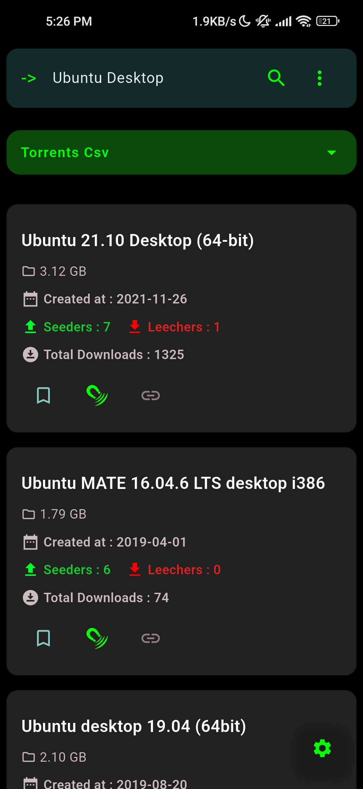
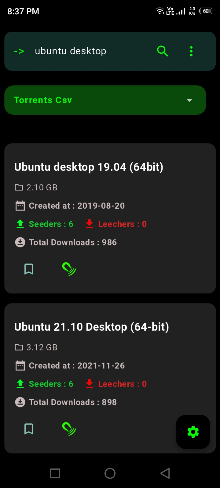
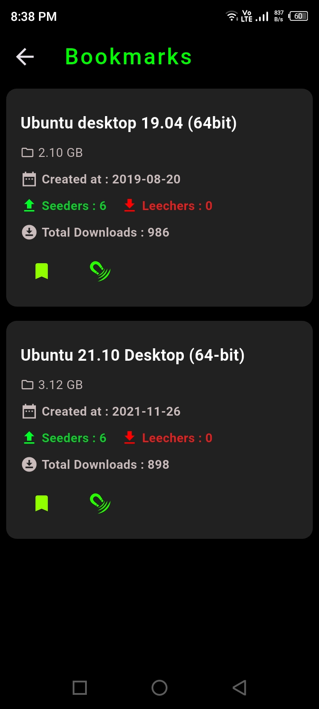
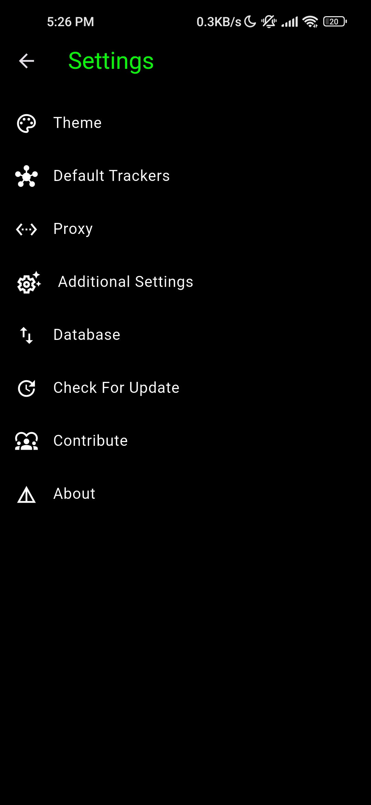
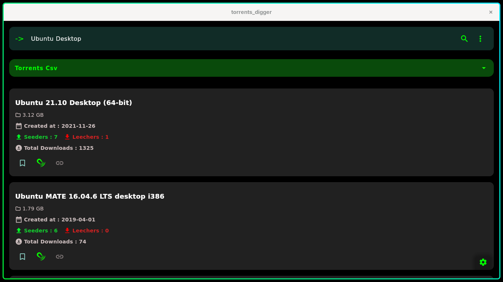
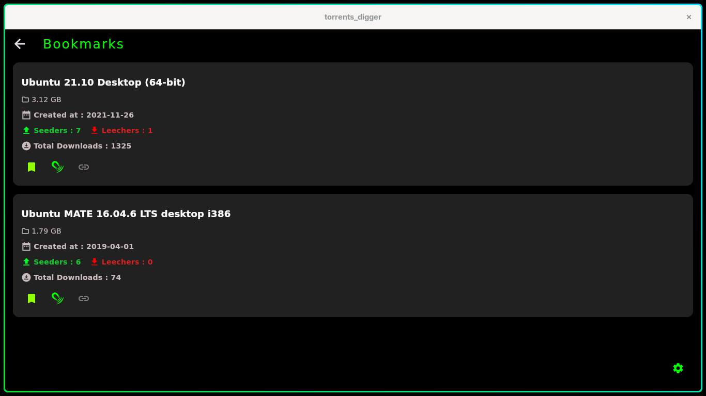
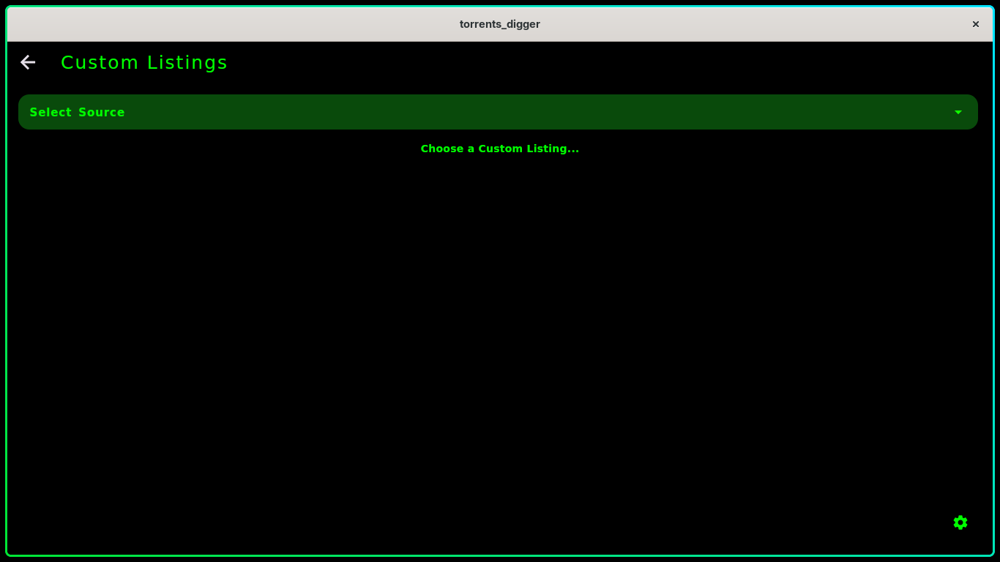
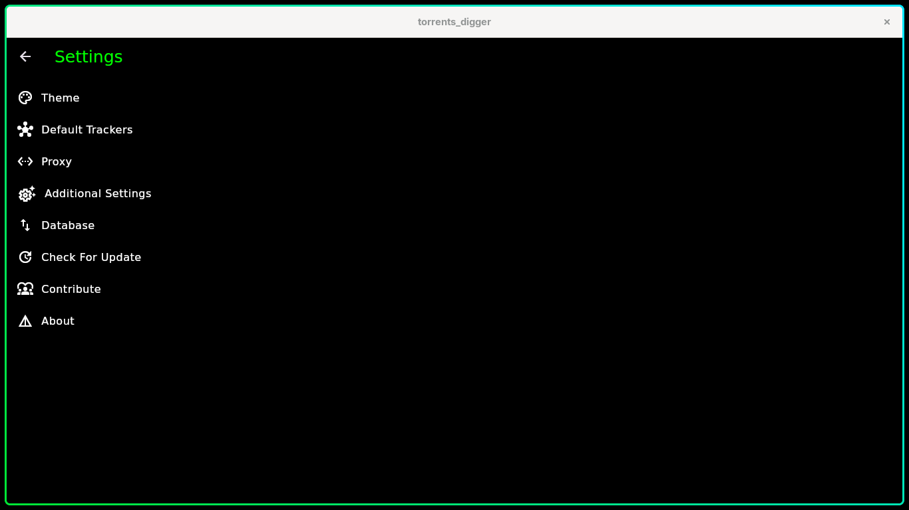

# Torrents Digger - Digs Torrents from the Internet.

### -> Join [Matrix Room](https://matrix.to/#/#forthecommunity_space:matrix.org)


## Features

* **Multi-Source Support** – Search torrents across multiple supported torrent sources/sites.

* **Detailed Torrent Information** – View torrent creation date, size, seeders, leechers, and total download counts.

* **Advanced Filtering & Sorting** – Filter results by category and customize sorting options and sort order.

* **Bookmarks & Custom Categories** – Bookmark torrents and group them into user-defined categories for better organization and quick access.

* **Magnet Link Copying** – Copy magnet links directly to your clipboard with a single click.

* **External Torrent Client Integration** – Open magnet links directly in your preferred torrent downloader application.

* **Default Tracker Lists** – Select a default tracker list that is automatically appended to magnet links.

* **Custom Listings** – Browse curated torrent listings such as **Trending**, **Latest**, and other source-specific collections.

* **Multiple Themes** – Personalize the application's appearance with a variety of built-in themes.

* **Proxy Support** – Route traffic through proxies for enhanced privacy and accessibility.

  Supported protocols:

  * HTTP
  * HTTPS
  * SOCKS4
  * SOCKS5

* **Database Import & Export** – Back up and restore application data, including bookmarks and settings.

* **Cross-Platform Support** – Available on:

  * Android
  * Windows
  * Linux


## --> Screenshots

<details>
<summary><b>Android Screenshots</b></summary>

<br>

<p align="center">
  
  
  
  
</p>

</details>

<details>
<summary><b>Linux Screenshots</b></summary>

<br>

<p align="center">
  <a href="flatpak/screenshots/1.png">
    
  </a>

  <a href="flatpak/screenshots/2.png">
    
  </a>

  <a href="flatpak/screenshots/3.png">
    
  </a>

  <a href="flatpak/screenshots/4.png">
    
  </a>
</p>

</details>

## --> Download | Install :
[](https://f-droid.org/packages/org.forthecommunity.torrentsdigger)

<a href='https://flathub.org/apps/io.gitlab.ForTheCommunity.torrentsdigger'>
    
  </a>


## --> Install using [AppMan](https://github.com/ivan-hc/AppMan)/[AM](https://github.com/ivan-hc/AM).
```
appman install torrents_digger
```

## --> Download binaries from [releases](https://gitlab.com/ForTheCommunity/torrentsdigger/-/releases) Page.


### TODOS :
- Save Search History.

- All Source Search.

- Automatically Update Bookmarked Torrent Data (Like seeders, leechers , total downloads) when Researched (opt-in,opt-out).

- Log Screen for showing Execution Logs.

- TUI APP (using Ratatui, basic project structure is made in tui directory).

- NSFW Toogle Button.


## Support
If you find this project useful, consider supporting its development.
<br>
**Monero (XMR):**
`83eg4LiD5PEWGu6JpU2mfQVmVdNJQfKzGAi5GUGZKBkBdWBaGxxUrifCj1WyiUEtUfLNaxQjcfHDaDtxfZhr7RboPCVvTYf`


## Disclaimer ->
`Torrents Digger doesn't host anything.
It just searches and lists publicly available torrents from third party sites.
Developers of Torrents Diggers can't be held responsible if anyone downloads copyrighted materials.
Becarefull what you download; ensure you are following your country's law.`


## License

This project is licensed under the **[Unlicense](https://unlicense.org)**. You can view the full license text in the [UNLICENSE](./UNLICENSE) file.


## Contribute
See [Contribution Guide](./CONTRIBUTING.md).


## Contributors :
1. ShaswotNepal [Role ⮞ Maintainer] ([Gitlab](https://gitlab.com/ShaswotNepal)).

2. Wind Xebec [Role ⮚ Contributor] ([Gitlab](https://gitlab.com/sameerchettri707) / [Github](https://github.com/ybsa)) :
- Wind Xebec : [Added Support For Windows 0S.](https://gitlab.com/ForTheCommunity/torrentsdigger/-/merge_requests/3)
- Wind Xebec : [Fixed URL Launch Issue & Fixed Icon not showing issue on Taskbar in Windows OS.](https://gitlab.com/ForTheCommunity/torrentsdigger/-/merge_requests/5)
- Wind Xebec : [Fixed Scaffold Messenger / SnackBar Theme Issue.](https://gitlab.com/ForTheCommunity/torrentsdigger/-/merge_requests/6)

3. Nia Ward [Role ⮚ Contributor] ([Gitlab](https://gitlab.com/Nia_Ward)) :
- Nia Ward : [Added Russian Metadata Translation for F-droid.](https://gitlab.com/ForTheCommunity/torrentsdigger/-/merge_requests/1)
