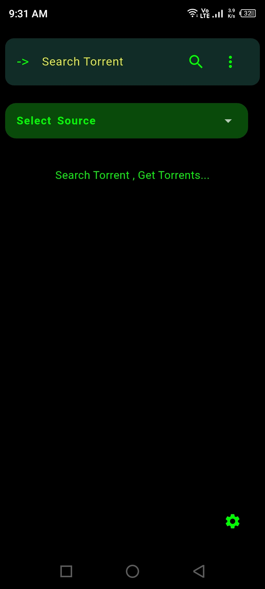
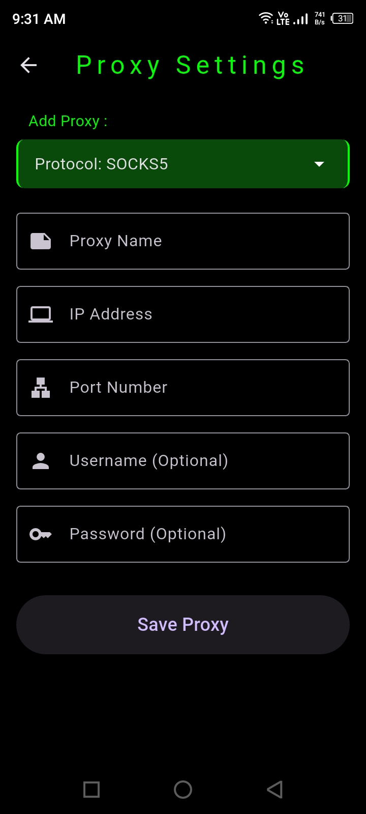

# Torrents Digger - Dig Torrents from Internet.

## Screenshots

    
    

 
 

    
    

### Note -> It only do the job of Fetching ,Scraping & Listing. Torrents Digger don't host anything , Torrent Digger just list what is already available in the internet.

## Building
See [Build Steps](./building.md) For Building this app.

## License

This project is licensed under the **[Unlicense](https://unlicense.org)**. You can view the full license text in the [UNLICENSE](./UNLICENSE) file.

